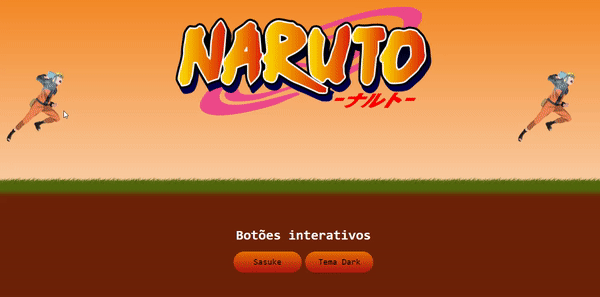

<h1 align="center">Portfolio in development</h1>

  <h1 align="center">MEDICENTER</h1>
  
  
Clone a website of a design credits to it at the end of the website.

   

  
 

<h1 align="center">MEDICENTER MOBILE</h1>

   

  
 

<h1 align="center">Churrascometro</h1>
    
A calculator to know how much meat and drink you should spend on a barbecue

    
   

  
 

 <h1 align="center">BlackPage</h1>
    
Project inspired by black Friday

  

  
 

<h1 align="center">LoginPage</h1>
    
Clone a login page

    
   

  
 

<h1 align="center">Card-Debit</h1>
    
Clone a Card-Itaú

    
   

  
 

  
  <h1 align="center">Cards Animates</h1>
    
...

    
   

  
 

<h1 align="center">404 Not Found</h1>
    
Clone a login page

    
   

  
 

